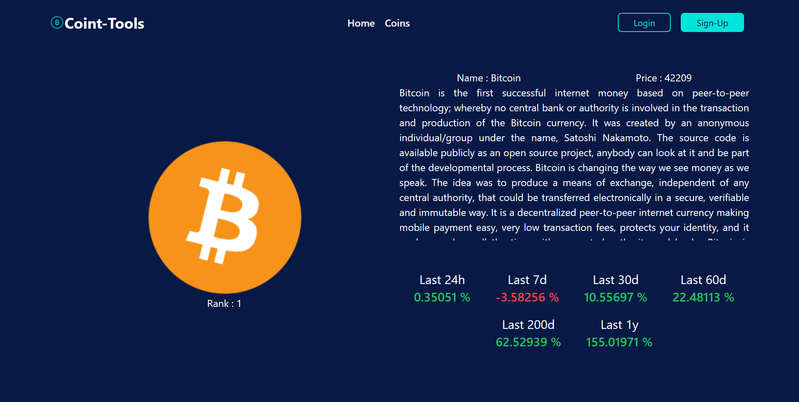
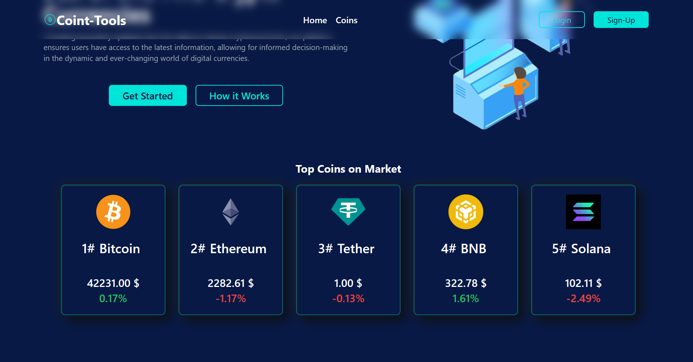

# COIN - TOOLS 

## Webapp To Display Realtime Crypto Currencies prices

This is a minimal implementation of serving data from api through ui interface 

## Tech Used

React and Tailwind

## Features 
- Cool Table
- Dynamic Detailed page 
- Lazy Loading 
- Cool Loading animation :#3

## ScreenShoot

|                         |                               |
:-------------------------:|:-------------------------:
 | 
 | 

## Live Preview 
https://coin-tools.vercel.app/home

## Additional update in the future
- cleaning some code
- write some comments
- add dark/light mode 

## Feedback
any feedback, comments , criticism even judges are welcome, send it to here mothra09876@gmail.com
